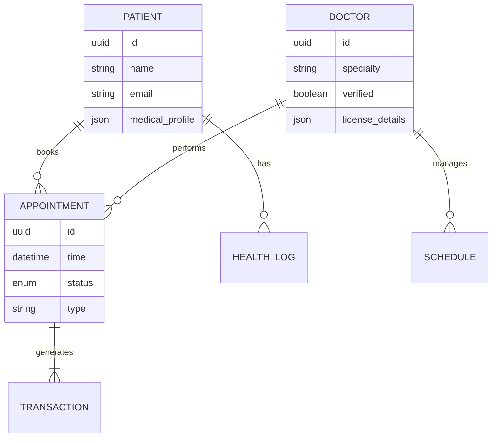

# System Architecture & Technical Design

## 1. High-Level Architecture
The platform follows a **Microservices-based** (or Modular Monolith for initial phase) architecture to ensure scalability and isolation of sensitive components.

### Core Services
1.  **Auth Service**: User identity, JWT issuance, MFA.
2.  **Patient Service**: Profiles, Bio-data, Medical History.
3.  **Provider Service**: Credentialing, Schedules, Availability.
4.  **Booking Service**: Appointments, Queue management.
5.  **Telehealth Service**: WebRTC signalling, Video session capability (using Twilio/Agora).
6.  **Payment Service**: Integration with M-Pesa, Stripe.

## 2. Technology Stack

### Backend
- **Framework**: Node.js with **NestJS** (TypeScript).
- **Reasoning**: Strongly typed, scalable, excellent support for microservices patterns.
- **API Style**: REST (for general app) + GraphQL (for complex data queries) + gRPC (inter-service).

### Frontend - Mobile (Patient & Provider Apps)
- **Framework**: **React Native** (TypeScript).
- **Reasoning**: Cross-platform (iOS/Android) with a single codebase; high performance.

### Frontend - Web (Admin & Specialist Dashboard)
- **Framework**: **Next.js** or **React** (Vite).
- **Reasoning**: SEO friendly for patient portal, fast rendering for dashboards.

### Database
- **Primary DB**: **PostgreSQL** (Managed Service like AWS RDS).
    - Structured data: Users, Appointments, Transactions.
- **NoSQL / Logs**: **MongoDB** or **Elasticsearch**.
    - Audit logs, chat history, raw device data.
- **Caching**: **Redis**.
    - Session management, realtime availability caching.

### Medical Data Standard
- **FHIR Server**: Integration with a FHIR-compliant store (Google Healthcare API or custom HAPI FHIR).

## 3. Database Schema (Simplified Relationship)

## 4. Deployment & Infrastructure

### Cloud Provider
- **AWS** (Preferred) or Google Cloud.
- **Region**: af-south-1 (Cape Town) for latency reduction in Kenya/Africa, or eu-central-1 for GDPR compliance.

### Containerization & Orchestration
- **Docker** for containerizing all services.
- **Kubernetes (EKS)** for orchestration, auto-scaling, and self-healing.

### CI/CD Pipeline
- **GitHub Actions**:
    1.  Lint & Test.
    2.  Build Docker Image.
    3.  Scan for Vulnerabilities (Snyk).
    4.  Deploy to Staging -> Production.

## 5. Mobile Deployment
- **iOS**: TestFlight -> App Store.
- **Android**: Play Console (Internal Track -> Production).
- **OTA Updates**: CodePush for rapid hotfixes (React Native).
